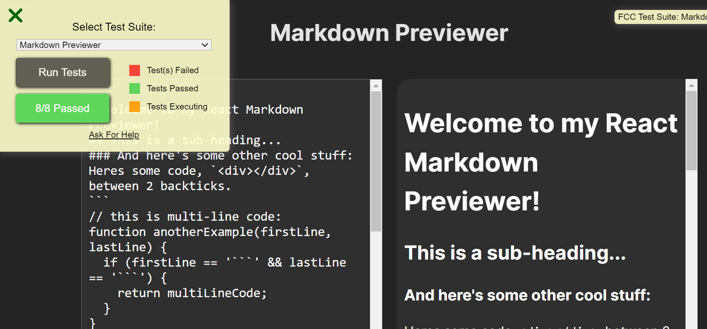

# Markdown Previewer



**Markdown Previewer** is a simple web application built with React and TypeScript that allows you to write and preview Markdown content in real-time.

## Features

- Real-time Markdown rendering.
- Edit and preview Markdown content side by side.
- Supports common Markdown features like headers, lists, links, and code blocks.
- Resolves the OPTIONAL BONUS in the FCC course, rendering the <br> elements by importing {marked} from "https://esm.sh/marked"

## Getting Started

### Prerequisites

Before you begin, ensure you have met the following requirements:

- **Node.js**: Make sure you have Node.js installed on your machine.

### Installation

Follow these steps to get the project up and running:

1. Clone the repository:

    ```bash
    git clone https://github.com/Bond7010/Markdown-previewer
    ```

2. Navigate to the project folder:

    ```bash
    cd Markdown-Previewer/markdown-previewer
    ```

3. Install dependencies:

    ```bash
    npm install
    ```

### Usage

1. Start the development server:

    ```bash
    npm start
    ```

2. Open your web browser and visit [http://localhost:3000](http://localhost:3000) to use the Markdown Previewer.

3. Edit the Markdown content in the left panel, and the preview will update in real-time on the right panel.

### Deployment

To deploy this project to a hosting platform (e.g., GitHub Pages, Netlify, Vercel), follow the deployment instructions for your chosen platform.

## Built With

- [React](https://reactjs.org/) - JavaScript library for building user interfaces.
- [TypeScript](https://www.typescriptlang.org/) - Typed superset of JavaScript.
- [Markdown](https://esm.sh/marked) - Markdown model
- [Other dependencies, if applicable]

## Contributing

Contributions are welcome! Please read [CONTRIBUTING.md](CONTRIBUTING.md) for details on our code of conduct and the process for submitting pull requests.

## License

This project is licensed under the MIT License. See [LICENSE.md](LICENSE.md) for details.

## Acknowledgments

- [Markdown](https://daringfireball.net/projects/markdown/) - The Markdown syntax and format.

## Contact

- Your Name - [xdongwang52@gmail.com](mailto:xdongwang52@gmail.com)
- Project Link: [https://github.com/Bond7010/Markdown-previewer](https://github.com/Bond7010/Markdown-previewer)
